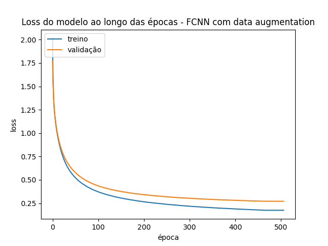
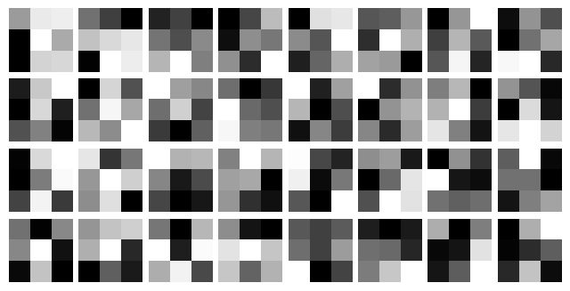

# Sobre o trabalho
Este trabalho trata-se de um exercício programa (EP) da  disciplina MAC5921 - Deep Learning do programa de pós-graduação em Ciência da Computação do IME-USP. A proposta desse trabalho consiste em comparar o desempenho de redes neurais convolucionais e redes neurais fully connected simples para a classificação de imagens.

O conjunto de dados utilizado para este trabalho é o [Kuzushiji-MNIST](https://github.com/rois-codh/kmnist), no qual esse repositório é um fork do repositório original que contém mais informações sobre o cunjunto de dados. Nesse repositório há a possibilidade de download de 3 datasets (Kuzushiji-MNIST, Kuzushiji-49 e Kuzushiji-Kanji), o escolhido para esse trabalho foi o Kuzushiji-MNIST dado ser o conjunto com a menor quantidade de classes, o que facilita os experimentos. 

O Kuzushiji-MNIST possui um total de 10 classes, sendo cada uma delas um caracter do Hiragana. Uma representação de cada uma das classes pode ser vista abaixo, sendo cada "linha" uma classe, a primeira "coluna" sendo um bom exemplo (digital) do caracter e as outras sendo exemplos escritos à mão.

<p align="center">
  
</p>

# Modelos treinados

## Sobre os modelos

Os modelos treinados são CNN (Convolucional Neural Network) e FCNN (Fully Connected Neural Network) simples, além de testar algumas alterações para ver se essas melhoram ou pioram o desempenho. Assim resultando nos seguintes testes:

- <strong>CNN</strong>: modelo CNN simples
- <strong>FCNN</strong>: modelo FCNN simples
- <strong>CNN com data augmentation</strong>: modelo CNN com dados aumentados em 10x
- <strong>FCNN sem data augmentation</strong>: modelo FNN com dados aumentados em 10x
- <strong>CNN sem camada de polling</strong>: modelo CNN removendo a camada de polling

Todos os modelos foram criados utilizando o [keras](https://www.tensorflow.org/guide/keras). 

Abaixo há as imagens dos melhores modelos encontrados para a CNN e FCNN. Os outros modelos são bastante parecidos, havendo apenas as mudanças comentadas acima, porém caso queira visualizar as outras imagens dos modelos olhe em `images/models/`.

CNN              |          FCNN 
:-------------------------:|:-------------------------:
  |  


FALAR SOBRE O MESMO NUMERO DE PARÂMETROS

## Sobre o Data Augmentation

Durante o processo de data augmentation, diversas transformações são aplicadas às imagens para gerar variações do conjunto original. As imagens são rotacionadas em até 10 graus, deslocadas horizontalmente e verticalmente em até 10% da largura e altura, respectivamente, e também são sujeitas a um pequeno cisalhamento de até 10%. Além disso, as imagens podem ser aumentadas ou reduzidas em até 10% do seu tamanho original através de zoom. Foi escolhido realizar apenas uma mudança de 10% nesses aspectos pois mudanças mais drasticas, como rotacionar muito a imagem, poderiam transformar um caracter em outro, algo semelhante ao que vemos em rotacionar o "6" e transformar em um "9".

Essas modificações ajudam o modelo a generalizar melhor, fornecendo diferentes perspectivas de cada imagem de treino. No entanto, o flip horizontal não foi aplicado, o que preserva a orientação original das imagens. Por fim, as áreas criadas durante as transformações são preenchidas utilizando o método 'nearest', que replica o valor do pixel mais próximo para evitar a introdução de artefatos visuais.

O data augmentation foi realizado utilizando a classe `ImageDataGenerator` do keras.


# Resultados

## Metricas de classificação

<div style="display: flex; justify-content: space-between;">

<div style="width: 45%;">
<h3>CNN</h3>
<table border="1" class="dataframe">
  <thead>
    <tr style="text-align: right;">
      <th></th>
      <th>precision</th>
      <th>recall</th>
      <th>f1-score</th>
    </tr>
  </thead>
  <tbody>
    <tr>
      <th>0</th>
      <td>0.923077</td>
      <td>0.900</td>
      <td>0.911392</td>
    </tr>
    <tr>
      <th>1</th>
      <td>0.895789</td>
      <td>0.851</td>
      <td>0.872821</td>
    </tr>
    <tr>
      <th>2</th>
      <td>0.835603</td>
      <td>0.859</td>
      <td>0.847140</td>
    </tr>
    <tr>
      <th>3</th>
      <td>0.895382</td>
      <td>0.950</td>
      <td>0.921883</td>
    </tr>
    <tr>
      <th>4</th>
      <td>0.868000</td>
      <td>0.868</td>
      <td>0.868000</td>
    </tr>
    <tr>
      <th>5</th>
      <td>0.943169</td>
      <td>0.863</td>
      <td>0.901305</td>
    </tr>
    <tr>
      <th>6</th>
      <td>0.837125</td>
      <td>0.920</td>
      <td>0.876608</td>
    </tr>
    <tr>
      <th>7</th>
      <td>0.941495</td>
      <td>0.869</td>
      <td>0.903796</td>
    </tr>
    <tr>
      <th>8</th>
      <td>0.839070</td>
      <td>0.902</td>
      <td>0.869398</td>
    </tr>
    <tr>
      <th>9</th>
      <td>0.911704</td>
      <td>0.888</td>
      <td>0.899696</td>
    </tr>
    <tr>
      <th>accuracy</th>
      <td>0.887000</td>
      <td>0.887</td>
      <td>0.887000</td>
    </tr>
    <tr>
      <th>macro avg</th>
      <td>0.889041</td>
      <td>0.887</td>
      <td>0.887204</td>
    </tr>
    <tr>
      <th>weighted avg</th>
      <td>0.889041</td>
      <td>0.887</td>
      <td>0.887204</td>
    </tr>
  </tbody>
</table>
</div>

<div style="width: 45%;">
<h3>FCNN</h3>
<table border="1" class="dataframe">
  <thead>
    <tr style="text-align: right;">
      <th></th>
      <th>precision</th>
      <th>recall</th>
      <th>f1-score</th>
    </tr>
  </thead>
  <tbody>
    <tr>
      <th>0</th>
      <td>0.879753</td>
      <td>0.8560</td>
      <td>0.867714</td>
    </tr>
    <tr>
      <th>1</th>
      <td>0.835210</td>
      <td>0.8160</td>
      <td>0.825493</td>
    </tr>
    <tr>
      <th>2</th>
      <td>0.729828</td>
      <td>0.8050</td>
      <td>0.765573</td>
    </tr>
    <tr>
      <th>3</th>
      <td>0.871698</td>
      <td>0.9240</td>
      <td>0.897087</td>
    </tr>
    <tr>
      <th>4</th>
      <td>0.802469</td>
      <td>0.7800</td>
      <td>0.791075</td>
    </tr>
    <tr>
      <th>5</th>
      <td>0.906532</td>
      <td>0.8050</td>
      <td>0.852754</td>
    </tr>
    <tr>
      <th>6</th>
      <td>0.774623</td>
      <td>0.8730</td>
      <td>0.820874</td>
    </tr>
    <tr>
      <th>7</th>
      <td>0.875143</td>
      <td>0.7640</td>
      <td>0.815804</td>
    </tr>
    <tr>
      <th>8</th>
      <td>0.768956</td>
      <td>0.8620</td>
      <td>0.812824</td>
    </tr>
    <tr>
      <th>9</th>
      <td>0.884106</td>
      <td>0.8010</td>
      <td>0.840504</td>
    </tr>
    <tr>
      <th>accuracy</th>
      <td>0.828600</td>
      <td>0.8286</td>
      <td>0.828600</td>
    </tr>
    <tr>
      <th>macro avg</th>
      <td>0.832832</td>
      <td>0.8286</td>
      <td>0.828970</td>
    </tr>
    <tr>
      <th>weighted avg</th>
      <td>0.832832</td>
      <td>0.8286</td>
      <td>0.828970</td>
    </tr>
  </tbody>
</table>
</div>

</div>

<div align = 'center'>
<h3>CNN sem polling</h3>
<table border="1" class="dataframe">
  <thead>
    <tr style="text-align: right;">
      <th></th>
      <th>precision</th>
      <th>recall</th>
      <th>f1-score</th>
    </tr>
  </thead>
  <tbody>
    <tr>
      <th>0</th>
      <td>0.902538</td>
      <td>0.8890</td>
      <td>0.895718</td>
    </tr>
    <tr>
      <th>1</th>
      <td>0.880705</td>
      <td>0.8490</td>
      <td>0.864562</td>
    </tr>
    <tr>
      <th>2</th>
      <td>0.770221</td>
      <td>0.8380</td>
      <td>0.802682</td>
    </tr>
    <tr>
      <th>3</th>
      <td>0.891221</td>
      <td>0.9340</td>
      <td>0.912109</td>
    </tr>
    <tr>
      <th>4</th>
      <td>0.863169</td>
      <td>0.8390</td>
      <td>0.850913</td>
    </tr>
    <tr>
      <th>5</th>
      <td>0.906048</td>
      <td>0.8390</td>
      <td>0.871236</td>
    </tr>
    <tr>
      <th>6</th>
      <td>0.832407</td>
      <td>0.8990</td>
      <td>0.864423</td>
    </tr>
    <tr>
      <th>7</th>
      <td>0.922574</td>
      <td>0.8460</td>
      <td>0.882629</td>
    </tr>
    <tr>
      <th>8</th>
      <td>0.819870</td>
      <td>0.8830</td>
      <td>0.850265</td>
    </tr>
    <tr>
      <th>9</th>
      <td>0.907741</td>
      <td>0.8560</td>
      <td>0.881112</td>
    </tr>
    <tr>
      <th>accuracy</th>
      <td>0.867200</td>
      <td>0.8672</td>
      <td>0.867200</td>
    </tr>
    <tr>
      <th>macro avg</th>
      <td>0.869649</td>
      <td>0.8672</td>
      <td>0.867565</td>
    </tr>
    <tr>
      <th>weighted avg</th>
      <td>0.869649</td>
      <td>0.8672</td>
      <td>0.867565</td>
    </tr>
  </tbody>
</table>
</div>

<div style="display: flex; justify-content: space-between;">

<div style="width: 45%;">
<h3>CNN com data augmentation</h3>
<table border="1" class="dataframe">
  <thead>
    <tr style="text-align: right;">
      <th></th>
      <th>precision</th>
      <th>recall</th>
      <th>f1-score</th>
    </tr>
  </thead>
  <tbody>
    <tr>
      <th>0</th>
      <td>0.948090</td>
      <td>0.9680</td>
      <td>0.957942</td>
    </tr>
    <tr>
      <th>1</th>
      <td>0.887888</td>
      <td>0.8870</td>
      <td>0.887444</td>
    </tr>
    <tr>
      <th>2</th>
      <td>0.908429</td>
      <td>0.8730</td>
      <td>0.890362</td>
    </tr>
    <tr>
      <th>3</th>
      <td>0.862555</td>
      <td>0.9790</td>
      <td>0.917096</td>
    </tr>
    <tr>
      <th>4</th>
      <td>0.904762</td>
      <td>0.8930</td>
      <td>0.898842</td>
    </tr>
    <tr>
      <th>5</th>
      <td>0.983462</td>
      <td>0.8920</td>
      <td>0.935501</td>
    </tr>
    <tr>
      <th>6</th>
      <td>0.885446</td>
      <td>0.9430</td>
      <td>0.913317</td>
    </tr>
    <tr>
      <th>7</th>
      <td>0.967391</td>
      <td>0.8900</td>
      <td>0.927083</td>
    </tr>
    <tr>
      <th>8</th>
      <td>0.904374</td>
      <td>0.8890</td>
      <td>0.896621</td>
    </tr>
    <tr>
      <th>9</th>
      <td>0.918787</td>
      <td>0.9390</td>
      <td>0.928783</td>
    </tr>
    <tr>
      <th>accuracy</th>
      <td>0.915300</td>
      <td>0.9153</td>
      <td>0.915300</td>
    </tr>
    <tr>
      <th>macro avg</th>
      <td>0.917118</td>
      <td>0.9153</td>
      <td>0.915299</td>
    </tr>
    <tr>
      <th>weighted avg</th>
      <td>0.917118</td>
      <td>0.9153</td>
      <td>0.915299</td>
    </tr>
  </tbody>
</table>

</div>

<div style="width: 45%;">
<h3>FCNN com data augmentation</h3>
<table border="1" class="dataframe">
  <thead>
    <tr style="text-align: right;">
      <th></th>
      <th>precision</th>
      <th>recall</th>
      <th>f1-score</th>
    </tr>
  </thead>
  <tbody>
    <tr>
      <th>0</th>
      <td>0.864594</td>
      <td>0.8620</td>
      <td>0.863295</td>
    </tr>
    <tr>
      <th>1</th>
      <td>0.836735</td>
      <td>0.8200</td>
      <td>0.828283</td>
    </tr>
    <tr>
      <th>2</th>
      <td>0.735950</td>
      <td>0.8250</td>
      <td>0.777935</td>
    </tr>
    <tr>
      <th>3</th>
      <td>0.880424</td>
      <td>0.9130</td>
      <td>0.896416</td>
    </tr>
    <tr>
      <th>4</th>
      <td>0.795292</td>
      <td>0.7770</td>
      <td>0.786039</td>
    </tr>
    <tr>
      <th>5</th>
      <td>0.915040</td>
      <td>0.7970</td>
      <td>0.851951</td>
    </tr>
    <tr>
      <th>6</th>
      <td>0.786364</td>
      <td>0.8650</td>
      <td>0.823810</td>
    </tr>
    <tr>
      <th>7</th>
      <td>0.891101</td>
      <td>0.7610</td>
      <td>0.820928</td>
    </tr>
    <tr>
      <th>8</th>
      <td>0.764810</td>
      <td>0.8650</td>
      <td>0.811825</td>
    </tr>
    <tr>
      <th>9</th>
      <td>0.879828</td>
      <td>0.8200</td>
      <td>0.848861</td>
    </tr>
    <tr>
      <th>accuracy</th>
      <td>0.830500</td>
      <td>0.8305</td>
      <td>0.830500</td>
    </tr>
    <tr>
      <th>macro avg</th>
      <td>0.835014</td>
      <td>0.8305</td>
      <td>0.830934</td>
    </tr>
    <tr>
      <th>weighted avg</th>
      <td>0.835014</td>
      <td>0.8305</td>
      <td>0.830934</td>
    </tr>
  </tbody>
</table>
</div>

</div>


## Épocas x Loss

CNN             |  FCNN
:-------------------------:|:-------------------------:
  |  


<p align="center">
  
</p>

CNN com Data Augmentation             |  FCNN com Data Augmentation
:-------------------------:|:-------------------------:
  |  

## Visualização dos Kernels das CNNs

Abaixo há uma imagem de uma representação dos kernels criadas na primeira camada convolucional:


Abaixo há uma imagem de uma representação dos kernels criadas na segunda camada convolucional:


# Instruções

## 1. Configurar ambiente


Para realizar os experimentos, foi utilizado um ambiente virtual do conda utilizando o python 3.10.12. O ambiente pode ser criado como abaixo:

```
conda create --name env-kmnist  python=3.10.12
```

Para instalar os pacotes utilizados para os experiementos, dentro do ambiente virtual do conda, utilize o comando abaixo:

```
pip install -r requirements
```

## 2. Download do dataset

Para realizar o download do dataset, rode o comando:

```
python src/download_data.py
```

Dessa forma o dataset irá ser baixado e colocado na pasta `data/`

## 3. Reproduzir experimentos

Para reproduzir os experimentos basta rodar o notebook `notebooks/classification.ipynb` para treinar e testar os modelos. Assim, os melhores modelos serão salvos no diretório `models`, os logs do treinamento dos modelos irão constar no diretório `logs` e os resultados dos modelos no conjunto de treino e de teste irão estar no diretório `results`.

Após reproduzir os resultados, é possível através do notebook `notebooks/2.results_analysis.ipynb` gerar os gráficos de desempenho do modelo, que estarão no diretório `images/results_plt/`, e também gerar as tabelas de com as métricas de classificação (acurácia, recall, precision, F1, etc) que estarão no diretório `results/metrics/`.

Para obter as imagens das arquiteturas dos modelos e dos kernels, rode o notebook `notebooks/3.models_analysis.ipynb`. Para gerar a imagem da arquitetura do modelo, garanta que tem instalado em seu ambiente o graphviz, instale com `sudo apt install graphviz -y`


